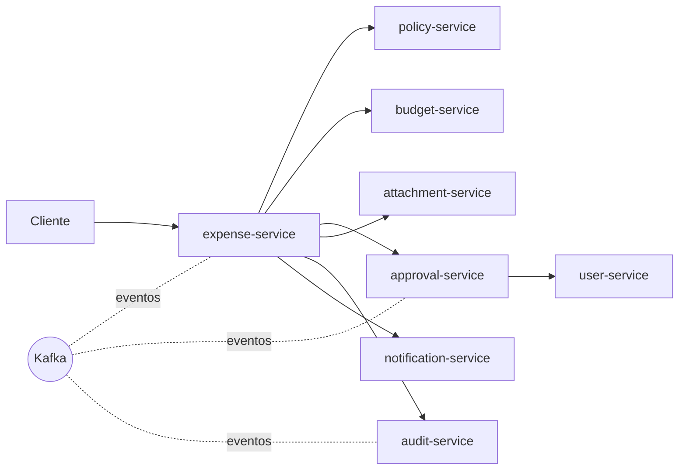

# Arquitetura

## Visao geral
Plataforma interna de aprovacao de despesas e reembolsos, com foco em auditoria e consistencia.
O contexto inclui regras de negocio acopladas (politicas, centros de custo, orcamento, compliance e anexos).

## Servicos e responsabilidades
- expense-service: ciclo de vida da despesa e orquestracao do fluxo.
- approval-service: workflow de aprovacao e decisoes.
- policy-service: politicas e regras de gastos.
- user-service: colaboradores, perfis e hierarquia.
- budget-service: orcamento e centro de custo.
- notification-service: email/slack.
- attachment-service: upload e anexos.
- audit-service: trilha de auditoria.

## Comunicacao
- REST sincrono entre servicos.
- Kafka existe, mas o uso atual e limitado e inconsistente.

## Dados
- Uma base por servico no papel.
- Na pratica, ha duplicacao de tabelas e replicacao manual.
- Risco de divergencia de estado e retrabalho em mudancas.

## Problema observado: distributed monolith
- Fluxos simples viram coreografia distribuida.
- Mudancas em regras exigem alteracoes em varios servicos.
- Erros parciais e compensacoes aumentam a complexidade.
- Auditoria e consistencia ficam mais dificeis de garantir.

## Diagrama (alto nivel)

