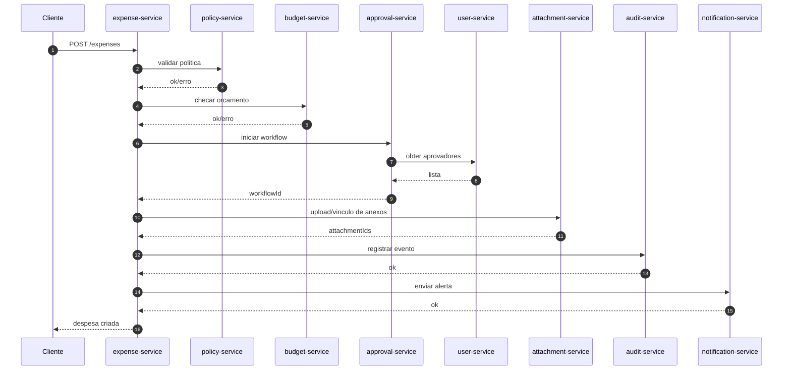

# Fluxo: criar despesa

## Objetivo
Registrar uma despesa com validacao de politica, checagem de orcamento, aprovadores, anexos,
auditoria e notificacao.

## Passos sincronos (estado atual)
1) Cliente envia `POST /expenses` para o expense-service.
2) expense-service valida politica no policy-service.
3) expense-service checa orcamento no budget-service.
4) expense-service inicia workflow no approval-service.
5) approval-service busca aprovadores no user-service.
6) expense-service envia anexos ao attachment-service.
7) expense-service registra auditoria no audit-service.
8) expense-service envia notificacao no notification-service.

## Diagrama de sequencia (simplificado)

## Pontos criticos
- Falha em qualquer passo exige compensacao ou reprocesso.
- Consistencia deve ser observada no ciclo de vida da despesa.
- Auditoria nao pode perder eventos, mesmo em erro parcial.
